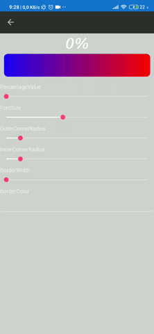

# Com.Igniscor.Progressbar

**Com.Igniscor.Progressbar** - is a cross platform plugin for Xamarin.Forms which allows you add progress bars with a wide range of customization options that can be shared across iOS and Android.


## Contents

1. [Setup](#Setup)
1. [Progress bars](#Progress-bars)
    - [Detailed progress bar](#Detailed-progress-bar)
    - [Radial progress bar](#Radial-progress-bar)
2. [How to use](#How-to-use)
---
## Setup

- Available on NuGet: [https://www.nuget.org/packages/Com.Igniscor.Progressbar/](https://www.nuget.org/packages/Com.Igniscor.Progressbar/)
- Install into your cross-platform project.
---
## Progress bars

#### Percentage value
This property set current progress. Use float value between 0 and 1.
```XAML
PercentageValue="{Binding PercentageValue}"
```
>You can of course use binding.
### Detailed progress bar

#### Orientation

***Horizontal and vertical orientation***


Use Orientation property to set progress bar orientation.
```XAML
Orientation="Horizontal"
```
```XAML
Orientation="Vertical"
```                    

#### Text orientation

Text orientation use to set position inside or outside the progress bar.
> If you set the orientation of the text to the start or end, your progress bar will shrink to fit the size of the text.

***Start***




```XAML
ProgressTextOrientation="Start"
```

***Center***


```XAML
ProgressTextOrientation="Center"
```

***End***


```XAML
ProgressTextOrientation="End"
```

#### Text position

This property is used to set the position of the text relative to progress.

***Start***


```XAML
ProgressTextPosition="Start"
```

***Center***


```XAML
ProgressTextPosition="Center"
```

***End***


```XAML
ProgressTextPosition="End"
```

***Relative***


```XAML
ProgressTextPosition="Relative"
```

***Attached***


```XAML
ProgressTextPosition="Attached"
```

#### Font

***Font size***


```XAML
FontSize="30"
```

You have the option to change the font:


```XAML
FontName="SansitaSwashed-Regular.ttf"
```

#### Text color

These options allow you to set the text color under different conditions.


Primary and secondary text color

```XAML
PrimaryTextColor="Black"
```
```XAML
SecondaryTextColor="White"
```

#### Progress bar color

Example with different start progress color, end progress color, start background color, end background color.


Colors are set like this:

```XAML
StartProgressColor="#E7FD8C"
EndProgressColor="#91C035"
```
```XAML
StartBackgroundColor="#1D00FB"
EndBackgroundColor="#FB0003"
```

#### Corner radius
You can set this property for the progress bar and it's background.

***Inner corner radius***

Set corner radius for progress bar.


```XAML
InnerCornerRadius="25"
```

***Outer corner radius***

Set corner radius for background.


```XAML
OuterCornerRadius="25"
```

#### Border

You can use a border. This will reduce the size of the progress bar itself. You can also set the color or not set it at all and get a transparent border. The corner radius of the border is anchored to the **Outer corner radius**.

> If your text orientation is center, your border width will be limited by the text size or text width depending on the orientation of the progress bar.

***Border width***


```XAML
BorderWidth="20"
```

***Border color***


```XAML
BorderColor="Black"
```

### Radial progress bar


#### Bar width
Sets the width of the progress bar.


```XAML
BarWidth="50"
```

#### Start angle
Sets the start of a progress bar.
Use this property with a value between 0 and 360.


```XAML
StartAngle="{Binding StartAngle}"
```

#### Sweep angle
Sets the size of the progress bar in degrees.
Use this property with a value between 0 and 360.


```XAML
SweepAngle="{Binding SweepAngle}"
```

#### Radial progress bar color
In the radial progress bar, the colors are set in the same way:
```XAML
StartColor="#E7FD8C"
EndColor="#91C035"
```
```XAML
StartBackgroundColor="#1D00FB"
EndBackgroundColor="#FB0003"
```

---
## How to use

First what you need it's connect namespace to your xaml file.
```XAML
    xmlns:gradientProgressBar="clr-namespace:Com.Igniscor.Controls.ProgressBar;assembly=Com.Igniscor.Controls"
```
After what you can use progress bar like that.

### Detailed progress bar

```XAML
    <gradientProgressBar:DetailedProgressBar
                        HorizontalOptions="FillAndExpand"
                        VerticalOptions="FillAndExpand"
                        Orientation="Horizontal"
                        PercentageValue="{Binding PercentageValue}"
                        OuterCornerRadius="{Binding OuterCornerRadius}"
                        InnerCornerRadius="{Binding InnerCornerRadius}"
                        FontSize="{Binding FontSize}"
                        BorderWidth="{Binding BorderWidth}"
                        BorderColor="{Binding BorderColor}"
                        FontName="{Binding FontName}"
                        ProgressTextPosition="Center"
                        ProgressTextOrientation="Center"
                        PrimaryTextColor="Black"
                        SecondaryTextColor="White"
                        StartProgressColor="#E7FD8C"
                        EndProgressColor="#91C035"
                        StartBackgroundColor="#1D00FB"
                        EndBackgroundColor="#FB0003" />
```

### Radial progress bar

```XAML
    <gradientRadialProgressBar:RadialProgressBar
                    SweepAngle="{Binding SweepAngle}"
                    StartAngle="{Binding StartAngle}"
                    PercentageValue="{Binding PercentageValue}"
                    BarWidth="{Binding BarWidth}"
                    StartColor="#E7FD8C"
                    EndColor="#91C035"
                    StartBackgroundColor="#FB0003"
                    EndBackgroundColor="#1D00FB"
                    WidthRequest="350"
                    HeightRequest="{Binding Source={RelativeSource Self}, Path=WidthRequest}"
                    HorizontalOptions="Center"
                    VerticalOptions="Center"
                    Margin="10" />
```

Of course you can change the font. You need to add custom font to your cross-platform project. In the example, we used SansitaSwashed-Regular.ttf.
When adding, set **"Build Action"** to **"Embedded resource"** and **"Copy to Output Directory"** to **"Do not copy"**.
